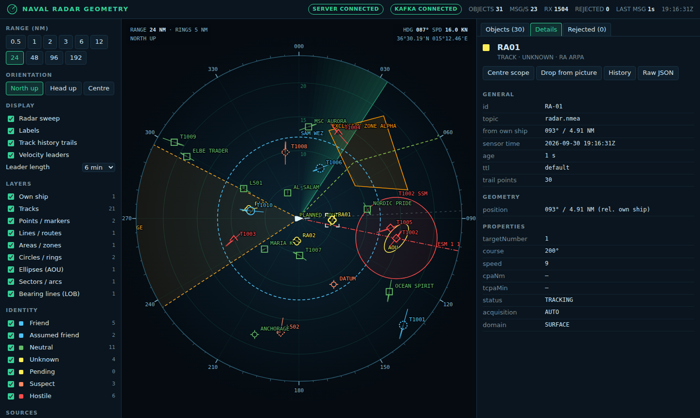

# Naval Radar Geometry (MERN + Kafka)

A MongoDB / Express / React / Node app that consumes naval and radar geometry from
**Kafka** and draws it live on a radar **PPI scope** in the browser.

```
 Kafka topics ──► Node consumer ──► adapter ──► normaliser ──► live picture (memory)
 (radar, ESM,      (kafkajs)        per topic   validation      │        │
  C2, nav, ...)                                                 │        └─► MongoDB (latest state + history)
                                                                └─► Socket.IO batches ──► React PPI scope
```



## Features

- **Kafka consumer** with multiple topics, a per-topic **adapter** for different message formats,
  and automatic reconnect with back-off.
- **Standard maritime formats** work without extra code:
  - **NMEA 0183** (IEC 61162-1): radar/ARPA targets (`TTM`, `TLL`) and own ship from GPS and gyro
    (`RMC`, `GGA`, `VTG`, `HDT`).
  - **AIS** `!AIVDM` / `!AIVDO` (ITU-R M.1371): messages 1–3, 18, 5 and 24.
  - **GeoJSON** (RFC 7946).
  - The app's own canonical JSON.
  - See [`samples/`](../samples/) for an example file in each format.
- **Geometry types:** own ship, tracks, points and markers, lines and routes, polygons and zones,
  circles (weapon or threat envelopes), ellipses (area of uncertainty), sectors and arcs (radar
  coverage, blind arcs), and bearing lines (ESM or jammer strobes).
- **Positions** can be absolute (`lat`/`lon`) or relative to own ship (`range`/`bearing`, in NM,
  km, m or yd). GeoJSON geometries and `Feature` / `FeatureCollection` messages are also accepted.
- **Live picture:**
  - The server keeps the latest state of every object and ignores out-of-order updates.
  - Tracks build a history trail.
  - Objects expire after a time-to-live (TTL), and a `DELETE` action removes them.
- **Batched WebSocket updates** (every 200 ms by default), so a high Kafka message rate doesn't
  overload the browser.
- **MongoDB:**
  - Stores the latest state, which is restored when the server restarts.
  - Keeps a message history that expires after a set time (TTL index), used by the History view.
- **React PPI scope:**
  - Range rings, bearing scale, and an animated sweep.
  - North-up and head-up modes.
  - Mouse-wheel range, drag to pan, and a cursor readout of bearing, range and lat/lon.
  - NTDS / MIL-STD-2525-style identity symbols, velocity leaders and track trails.
  - Layer, identity and source filters.
  - Object list, details panel and history view.
  - A log of rejected messages.

## Quick start

### Option A: everything in Docker

```bash
docker compose --profile sim up --build     # kafka + mongo + app + simulator
# open http://localhost:4000
```

To see the raw topics as well, add `--profile tools` for Kafka UI at http://localhost:8080.

### Option B: local development

Requirements: Node 18+ and Docker (only for Kafka and MongoDB).

```bash
npm install                 # root (concurrently)
npm run install:all         # server + client deps
cp server/.env.example server/.env
npm run infra               # starts kafka + mongo containers
npm run dev                 # API on :4000, React (Vite) on :5173
npm run simulate            # in another terminal: publishes live demo data to Kafka
# or publish the static sample files once:  npm --prefix server run samples
# open http://localhost:5173
```

Without Kafka, run `node scripts/simulator.js --http` from `server/`. It posts the same demo data
to `POST /api/ingest`.

Run the tests with `npm test`. That runs the server unit tests (normaliser, store, adapters)
and the client projection-math tests.

### Option C: demo without any backend

```bash
npm --prefix client run build:demo     # -> client/dist-demo/index.html
```

This builds a single self-contained HTML file that you can open directly in a browser. It runs
the real adapters, normaliser and live-picture store in the browser, on the same scenario that
`npm run simulate` publishes to Kafka. There's no Kafka, MongoDB or API server behind it, so it's
useful for showing the UI. For live development of the demo, run `npm --prefix client run dev:demo`.

## Geometry engines: Classic and Turf.js

The scope has two interchangeable rendering engines. Switch between them with the **Classic** and
**Turf.js** buttons at the top of the left panel, or press **T**. The choice is remembered in the
browser.

| | Classic (`RadarScope.jsx`) | Turf.js (`TurfRadarScope.jsx`) |
|---|---|---|
| Projection | Flat local plane around own ship | Azimuthal equidistant around own ship: the true radar picture |
| Accuracy | About 10 m at 24 NM, 100 m at 48 NM, 2.5 km at 192 NM | Range and bearing from own ship are exact at any distance |
| Shapes | Sampled in the flat plane | Built by Turf as geodesic GeoJSON: `circle`, `ellipse`, `lineArc`, `destination` |
| Zone alerts | None | Hostile, suspect, unknown and pending tracks inside a zone, weapon range or blind arc (`booleanPointInPolygon`) |
| Loading | Part of the main bundle | Loaded when first selected (about 8 KB gzipped) |

The Turf.js geometry code is in `client/src/lib/turfGeo.js`, with tests in `turfGeo.test.js`.

## Message format (canonical)

Send one JSON object per Kafka message. An array, `{ "items": [...] }` or a GeoJSON
`FeatureCollection` also works. Use the object id as the Kafka **key** so updates for one object
stay in order.

```jsonc
{
  "id": "T1001",                 // required, unique per object
  "kind": "TRACK",               // see table below (aliases like CONTACT, ZONE, STROBE, ARC also work)
  "action": "UPSERT",            // or "DELETE" (only id needed)
  "source": "SPY-RADAR",         // sensor/system, used for filtering
  "identity": "HOSTILE",         // FRIEND | ASSUMED_FRIEND | NEUTRAL | UNKNOWN | PENDING | SUSPECT | HOSTILE (or F/N/U/S/H)
  "label": "T1001",              // text shown on the scope (defaults to id)
  "timestamp": "2026-09-30T12:00:00Z", // ISO, epoch ms or epoch s. Older updates are ignored
  "ttlSec": 30,                  // optional: drop if not updated for 30 s (0 = never expire)
  "style": { "color": "#ff0", "fill": "#ff0", "fillOpacity": 0.1, "dashed": true, "width": 2 },
  "geometry": { ... },           // depends on kind
  "properties": {                // free-form, shown in the details panel
    "course": 270, "speed": 18,  // course/speed draw the velocity leader on tracks
    "domain": "AIR"              // AIR tracks use the open-top (air) symbol
  }
}
```

A **position** is either `{ "lat": 36.5, "lon": 15.2 }`, `[lon, lat]` (GeoJSON order), or
`{ "range": 12.5, "bearing": 45 }`. A range/bearing position is relative to own ship. The range
is in NM, or use `rangeKm`, `rangeM` or `rangeYd` for other units.

| kind      | geometry                                                                                | example use                                     |
|-----------|-----------------------------------------------------------------------------------------|-------------------------------------------------|
| `OWNSHIP` | `position` (must be lat/lon). `properties.heading` and `properties.speed`                | own ship nav data, the centre of the scope     |
| `TRACK`   | `position`                                                                              | radar/AIS/link tracks (trail kept by the server) |
| `POINT`   | `position`                                                                              | datum, sonobuoy, waypoint, reference point      |
| `LINE`    | `points: [pos, pos, ...]` (at least 2)                                                  | planned route, barrier, PIM                     |
| `POLYGON` | `points: [pos, pos, pos, ...]` (at least 3)                                             | exclusion zone, operating area, box             |
| `CIRCLE`  | `center?`, `radius` (NM)                                                                | weapon engagement zone, threat ring             |
| `ELLIPSE` | `center?`, `semiMajor`, `semiMinor` (NM), `orientation` (deg)                           | area of uncertainty, contact ellipse            |
| `SECTOR`  | `center?`, `startBearing`, `endBearing` (clockwise), `innerRadius?`, `outerRadius` (NM) | radar coverage, blind arc, sonar sector         |
| `BEARING` | `origin?`, `bearing`, `length?` (NM; default runs to the edge of the scope)             | ESM line of bearing, jammer strobe              |

If `center` or `origin` is left out, it defaults to own ship, so the shape moves with the ship.

Kafka CLI example:

```bash
docker exec -it kafka /opt/kafka/bin/kafka-console-producer.sh --bootstrap-server localhost:9092 --topic radar.geometry
> {"id":"ZONE-1","kind":"POLYGON","label":"BOX A","identity":"NEUTRAL","ttlSec":0,"geometry":{"points":[{"range":5,"bearing":10},{"range":8,"bearing":40},{"range":4,"bearing":70}]}}
```

## TypeScript definitions

[`types/geometry.d.ts`](types/geometry.d.ts) defines each geometry type. It has one input message
type per kind: `OwnshipMessage`, `TrackMessage`, `PointMessage`, `LineMessage`, `PolygonMessage`,
`CircleMessage`, `EllipseMessage`, `SectorMessage`, `BearingMessage` and `DeleteMessage`. It also
covers the GeoJSON and legacy payloads. On the output side, it types the canonical objects the UI
receives (`GeometryObject`, a union on `kind`) and the Socket.IO and REST payloads.
[`types/examples.ts`](types/examples.ts) has one valid example per geometry type.

```ts
import type { GeometryObject, SectorMessage } from './types/geometry';

const blindArc: SectorMessage = {
  id: 'BLIND-ARC', kind: 'SECTOR',
  geometry: { startBearing: 195, endBearing: 255, outerRadius: 30 },
};

function draw(obj: GeometryObject) {
  if (obj.kind === 'SECTOR') obj.geometry.outerRadius; // narrowed to SectorGeometry
}
```

From plain JavaScript you can use a JSDoc annotation instead:
`/** @type {import('../types/geometry').GeometryObject} */`.

Run `npm run typecheck` to compile the definitions and examples. It fails if the types and the
examples drift apart.

## Plugging in your own Kafka formats

Your upstream systems probably have their own schemas. You don't need to change the core code:

NMEA 0183 and AIS already have an adapter: bind the topic with `my.topic:nmea0183`. The Kafka
value is plain text, one or more sentences per message. For any other format:

1. Copy `server/src/kafka/adapters/legacyPlot.js`, for example to `myRadar.js`, and map your
   fields to the canonical format.
2. Register it in `server/src/kafka/adapters/index.js`.
3. Bind it to a topic: `KAFKA_TOPICS=radar.geometry,my.radar.topic:myRadar`.

Invalid messages are never dropped silently. They are counted, logged, and listed in the
**Rejected** tab with the reason and the payload.

## Configuration (`server/.env`)

| variable                                     | default                                        | description                                              |
|----------------------------------------------|------------------------------------------------|----------------------------------------------------------|
| `KAFKA_BROKERS`                              | `localhost:9092`                               | comma-separated list of brokers                          |
| `KAFKA_TOPICS`                               | `radar.geometry,radar.tracks,radar.ownship,radar.legacy-plots:legacyPlot,radar.nmea:nmea0183,ais.nmea:nmea0183,c2.zones` | `topic[:adapter]` list. Adapters: `canonical` (JSON / GeoJSON), `nmea0183`, `legacyPlot` |
| `KAFKA_GROUP_ID`                             | `naval-geometry-ui`                            | consumer group                                           |
| `KAFKA_FROM_BEGINNING`                       | `false`                                        | replay each topic from the start                         |
| `KAFKA_SSL`, `KAFKA_SASL_*`                  |                                                | secured clusters                                         |
| `KAFKA_ENABLED`                              | `true`                                         | set to `false` to use only HTTP ingest                   |
| `MONGO_URI`                                  | `mongodb://localhost:27017/naval_geometry`     |                                                          |
| `PERSIST_HISTORY` / `HISTORY_TTL_HOURS`      | `true` / `24`                                  | message history                                          |
| `DEFAULT_TTL_SEC`                            | `120`                                          | expiry for objects without a `ttlSec` (0 = never)        |
| `TRACK_HISTORY_LENGTH`                       | `30`                                           | number of trail points per track                         |
| `BROADCAST_INTERVAL_MS`                      | `200`                                          | how often batches go to the UI                           |

If MongoDB is down, the app keeps running with the in-memory picture only.

## REST API

| method   | path                                        | description                                           |
|----------|---------------------------------------------|-------------------------------------------------------|
| `GET`    | `/api/health`                               | server, Kafka and MongoDB status                      |
| `GET`    | `/api/stats`                                | message counters, messages per second, per-topic counts |
| `GET`    | `/api/geometries?kind=&identity=&source=`   | current picture                                       |
| `GET`    | `/api/geometries/:id`                       | one object                                            |
| `GET`    | `/api/geometries/:id/history?from=&to=&limit=` | stored messages (MongoDB)                          |
| `DELETE` | `/api/geometries/:id`                       | remove an object from the picture                     |
| `POST`   | `/api/ingest?adapter=`                      | push messages over HTTP                               |
| `GET`    | `/api/errors`                               | recently rejected messages                            |

Socket.IO events sent to the client: `snapshot` (the full picture), `geometry:batch`
(`{ upserts, deletes }`) and `status`.

## Project layout

```
server/
  src/index.js                 bootstrap
  src/kafka/consumer.js        kafkajs consumer, reconnect
  src/kafka/adapters/          per-topic format adapters (canonical, nmea0183, legacyPlot)
  src/services/normalizer.js   validation + canonical model
  src/services/geometryStore.js live picture, trails, TTL, batching
  src/services/persistence.js  MongoDB writes / history
  src/socket.js                Socket.IO broadcasting
  src/routes/api.js            REST API
  scripts/simulator.js         live demo scenario producer (NMEA, AIS, GeoJSON, JSON)
  scripts/publish-samples.js   publishes /samples to Kafka
samples/                       sample data in each supported format
client/
  src/components/RadarScope.jsx PPI scope (SVG)
  src/lib/geo.js               projection / range-bearing math
  src/lib/symbology.js         identity colours and symbols
  src/hooks/useTacticalPicture.js Socket.IO state
```

Keyboard shortcuts on the scope:

- `+` / `-`: change range
- `C`: re-centre on own ship
- `H`: switch between head-up and north-up
- `Esc`: clear the selection
